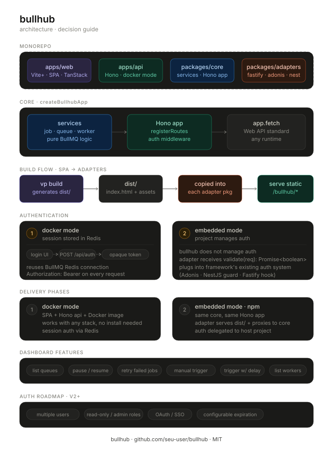

<div align="center">
  <h1>bullhub</h1>
  <p>A modern dashboard to manage, monitor and control your BullMQ queues and jobs.</p>

  <p>
    <a href="https://www.npmjs.com/package/bullhub"></a>
    <a href="https://www.npmjs.com/package/bullhub"></a>
    <a href="https://github.com/LeandroCesarr/bullhub/blob/main/LICENSE"></a>
  </p>

  
</div>

---

## Features

- **Queue management** — pause, resume, and clear queues
- **Job control** — retry failed jobs, trigger jobs manually, schedule with delay
- **Real-time visibility** — inspect job payloads, errors, and execution history
- **Worker overview** — see active workers and which queues they are consuming
- **Two deployment modes** — standalone Docker image or embedded into your existing app
- **Framework adapters** — Fastify, AdonisJS, NestJS (more coming)
- **Flexible auth** — built-in session auth for Docker mode, plug your own for embedded mode

---

## Getting started

### Docker mode

The fastest way to get started. Spin up the dashboard as a standalone container pointed at your Redis instance.

```bash
docker run -p 3000:3000 \
  -e BULLHUB_PASSWORD=yourpassword \
  -e REDIS_URL=redis://your-redis:6379 \
  ghcr.io/seu-user/bullhub
```

Then open [http://localhost:3000/bullhub](http://localhost:3000/bullhub).

### Embedded mode

Install the adapter for your framework and mount the dashboard directly into your existing app.

#### Fastify

```bash
npm install @bullhub/fastify
```

```ts
import Fastify from 'fastify'
import { bullhub } from '@bullhub/fastify'
import { Queue } from 'bullmq'

const app = Fastify()

const queues = {
  email: new Queue('email', { connection }),
  notifications: new Queue('notifications', { connection }),
}

app.register(bullhub, {
  queues,
  // plug your own auth — return true to allow, false to deny
  auth: async (req) => {
    const session = await validateSession(req)
    return session?.role === 'admin'
  },
})

app.listen({ port: 3000 })
```

#### AdonisJS

```bash
npm install @bullhub/adonis
```

```ts
// start/bullhub.ts
import { bullhub } from '@bullhub/adonis'

bullhub({
  queues,
  auth: async (req) => {
    // your existing adonis auth
  },
})
```

#### NestJS

```bash
npm install @bullhub/nest
```

```ts
import { BullhubModule } from '@bullhub/nest'

@Module({
  imports: [
    BullhubModule.register({
      queues,
      auth: async (req) => {
        // your existing nestjs guard logic
      },
    }),
  ],
})
export class AppModule {}
```

Once registered, the dashboard is available at `/bullhub` on your existing server.

---

## Architecture

Bullhub is built as a Turborepo monorepo with a clean separation between UI, core logic, and framework adapters.

```
bullhub/
├── apps/
│   ├── web/          # Vite+ SPA · TanStack Router
│   └── api/          # Hono server · Docker mode entry
├── packages/
│   ├── core/         # @bullhub/core · BullMQ services · Hono app · auth
│   ├── ui/           # shared React components
│   ├── fastify/      # @bullhub/fastify
│   ├── adonis/       # @bullhub/adonis
│   ├── nest/         # @bullhub/nest
│   └── config/       # shared tsconfig · eslint
```

The `core` package exposes a single `createBullhubApp(queues, opts)` function that returns a [Hono](https://hono.dev) app. Because Hono uses the standard Web API `fetch` handler, the same app works in Docker mode and inside any framework adapter — no logic is duplicated.

The SPA is built once with `vp build` and the resulting `dist/` is bundled into each adapter package before publishing to npm. Adapters serve it as static files under `/bullhub/*` with a SPA fallback to `index.html`.

---

## Authentication

### Docker mode

Bullhub ships with a simple session-based auth for the standalone mode. Sessions are stored in the same Redis instance that BullMQ uses — no extra dependencies.

```
login form → POST /bullhub/api/auth → validates password → opaque token → Redis session
```

Set your password via the `BULLHUB_PASSWORD` environment variable.

### Embedded mode

In embedded mode, Bullhub does not manage authentication. You provide a `validate` function when registering the adapter — Bullhub calls it on every API request and denies access if it returns `false`.

```ts
bullhub({
  queues,
  auth: async (req: Request): Promise<boolean> => {
    // your logic here
  },
})
```

This keeps Bullhub decoupled from any auth strategy and lets you reuse whatever is already in your project.

---

## Environment variables

| Variable            | Description                              | Default     |
|---------------------|------------------------------------------|-------------|
| `BULLHUB_PASSWORD`  | Password for the login screen (Docker)   | —           |
| `REDIS_URL`         | Redis connection string (Docker)         | —           |
| `PORT`              | Server port (Docker)                     | `3000`      |

---

## Roadmap

- [x] Docker mode
- [x] `@bullhub/fastify`
- [x] `@bullhub/adonis`
- [x] `@bullhub/nest`
- [ ] Multiple users with roles (read-only / admin)
- [ ] Configurable session expiration
- [ ] `@bullhub/express`

---

## Contributing

Contributions are welcome. Please open an issue first to discuss what you would like to change.

```bash
# clone the repo
git clone https://github.com/seu-user/bullhub.git
cd bullhub

# install dependencies
pnpm install

# start dev
pnpm dev
```

---

## License

[MIT](./LICENSE) © seu-user