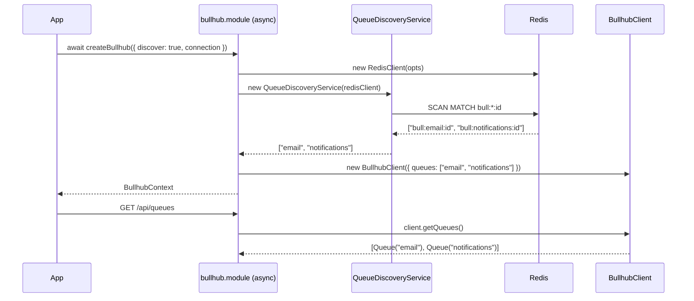

## Context

Currently `BullhubClient` receives the complete queue list at construction time via `BullhubOptions.queues`. If the user's application adds or removes a queue, Bullhub must be restarted with an updated list. For projects with many queues this is a manual and error-prone step.

BullMQ stores queue state in Redis using a predictable key pattern: `{prefix}:{queueName}:{subkey}`. The `:id` counter key (e.g. `bull:email-queue:id`) is created the moment a queue is instantiated and persists for its lifetime — making it a cheap, stable signal for discovery. A Redis `SCAN` over these keys gives us all active queue names without any changes to BullMQ itself.

## Goals / Non-Goals

**Goals:**
- Allow `queues` to be omitted when `discover` is set in `BullhubOptions`
- Automatically scan Redis at startup to discover existing BullMQ queues
- Merge discovered queues with any explicitly provided `queues`
- Remain fully backward-compatible — existing callers passing `queues: [...]` are unaffected
- Keep the public API clean: no dynamic queue mutation methods (`registerQueue`/`unregisterQueue`)

**Non-Goals:**
- Periodic refresh / live detection of new queues after startup (restart-to-refresh is acceptable)
- Real-time keyspace notifications
- Multi-prefix discovery in a single call
- Frontend changes — the existing `/api/queues` route reflects whatever the client holds

## Decisions

### 1. Detect queues via `{prefix}:*:id` SCAN pattern

BullMQ's `:id` key is the job counter, created at queue instantiation. It is a single key per queue, making it a cheap and stable discovery signal.

**Alternatives considered:**
- `:meta` key — also reliable but not present in all BullMQ versions
- `KEYS` command — blocks the Redis event loop; ruled out unconditionally
- Keyspace notifications — real-time but requires `notify-keyspace-events` config on Redis, adding an external setup dependency

### 2. Discovery happens before client construction — no dynamic mutation

`QueueDiscoveryService.discover()` is called inside `createBullhub` before `BullhubClient` is constructed. The discovered names are merged with explicit `opts.queues` and passed to `BullhubClient` as a plain array. After construction the client is immutable — no `registerQueue` or `unregisterQueue` needed.

```
discover() → [name, ...] → merge with opts.queues → new BullhubClient({ queues })
```

**Alternatives considered:**
- Dynamic `registerQueue`/`unregisterQueue` methods on `BullhubClient` — adds mutation surface and complexity with no benefit if periodic refresh is out of scope
- Lazy discovery on first HTTP request — complicates route handlers and delays errors; startup is the right moment

### 3. `createBullhub` becomes async

Discovery requires an async Redis scan. Making `createBullhub` return `Promise<BullhubContext>` is the minimal correct change. `registerBullhub` in the hono adapter follows suit.

This is a **breaking change** to the function signature, but necessary and correct. Callers simply `await` the result.

**Alternatives considered:**
- New `createBullhubAsync` variant alongside the sync one — avoids breaking changes but pollutes the API surface and creates confusion about which to use

### 4. `discover` option shape: `boolean | { prefix?, interval? }`

`discover: true` covers the common case (default prefix `"bull"`). The object form allows prefix tuning without cluttering top-level options.

```typescript
type BullhubDiscoverOptions = {
  prefix?: string; // Redis key prefix to scan (default: "bull")
};

interface BullhubOptions {
  queues?: BullhubOptionsQueue[]; // optional when discover is set
  discover?: boolean | BullhubDiscoverOptions; // NEW
  connection: ConnectionOptions;
  basePath?: string;
  metricsCount?: number;
}
```

### 5. `QueueDiscoveryService` uses the existing `RedisClient`

No new Redis connection is opened. The already-constructed `RedisClient` is passed in, keeping connection management centralised in the module.

## Sequence Diagram



## Risks / Trade-offs

- **New queues won't appear until restart** → Accepted for this scope. Restart-to-refresh is a well-understood operational model. Periodic refresh can be a follow-up change.
- **Breaking `createBullhub` signature** → Unavoidable; async discovery requires it. The adapter and API server both need a one-line `await` addition.
- **SCAN performance** → SCAN is non-blocking and cursor-based. The scan runs once at startup, not on every request.
- **Queue name extraction** → Key format `{prefix}:{name}:id` is stable in BullMQ v4+. Queues with `:` in their name are not supported by BullMQ itself.

## Migration Plan

1. `createBullhub` returns `Promise<BullhubContext>` — callers add `await`
2. `registerBullhub` in hono-adapter becomes async — `apps/api/src/index.ts` wraps startup in an async IIFE
3. `BULLMQ_AUTO_DISCOVER=true` env var enables discovery in the API server; when absent the existing env-var queue list is used
4. Explicit `queues` + `discover` together are both supported: discovered names are merged with the explicit list (deduplicating by name)

## Open Questions

- Should the scan prefix default to `"bull"` (BullMQ default) or should it be required when `discover` is used? → Default to `"bull"` for zero-config experience.
- Should discovered queues carry a `prefix` value on their `BullhubOptionsQueue`? → Yes, same as the scan prefix, so `BullhubClient` constructs them with the correct prefix.
