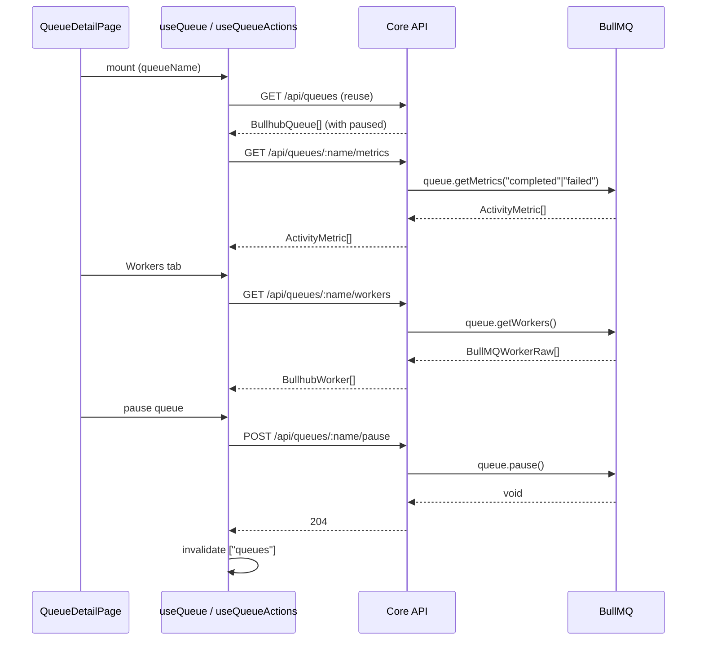

## Context

The project already has `QueueService.getActivityMetrics(queue)` and `BullhubQueue.fromBullMQ`
working, but no route exposes metrics per individual queue. `WorkerService.index()`
does N queries (one per registered queue) and there's no route for actions on queues.
The frontend uses mock data for workers and has no `/queues/:name` route.

## Goals / Non-Goals

**Goals:**
- `/queues/:queueName` page with Overview, Workers, Jobs tabs
- `paused` in the `BullhubQueue` model to display status
- `GET /api/queues/:name/metrics` route for the scoped chart
- `GET /api/queues/:name/workers` route with `WorkerService.listByQueue`
- `POST /api/queues/:name/pause`, `POST /api/queues/:name/resume`,
  `DELETE /api/queues/:name/drain` routes
- Remove `GET /api/workers` and `WorkerService.index()`

**Non-Goals:**
- Worker pagination
- Real-time via WebSocket
- Queue creation or editing

## Decisions

### 1. `paused` added to the `BullhubQueue` model

`Queue.isPaused()` is async — we add `paused: boolean` directly in
`BullhubQueue.fromBullMQ` (which is already async). The field appears in the
`GET /api/queues` response, avoiding a new endpoint just for this.

**Discarded alternative:** separate `GET /api/queues/:name` route — overhead
without real gain, the detail is already in the queues array.

### 2. useQueues() reused in the detail page — no new endpoint for basic data

The detail page calls `useQueues()` and filters by name on the client. The
`jobs`, `total`, and `paused` fields already arrive. Only activity metrics
need a new route.

**Discarded alternative:** dedicated `GET /api/queues/:name` — would duplicate
existing logic without a perceptible performance benefit.

### 3. Tab navigation via local state (not URL)

Tabs managed by `useState` on the page. Simple, no side effect on links.

**Discarded alternative:** `?tab=workers` query param — more complex for the
marginal benefit of a shareable URL; can be added later.

### 4. Client-side confirmation for Drain

`DELETE /api/queues/:name/drain` is destructive. The UI shows a `confirm()`
before calling it. The backend runs `Queue.drain()` without additional checks.

### 5. WorkerService simplified to a single call

```typescript
class WorkerService {
  async listByQueue(queueName: string): Promise<BullhubWorker[]>
}
```

`index()` removed along with `GET /api/workers`. The current Workers page uses
mock data — no real consumer broken.

## Relevant types

```typescript
// BullhubQueue — adds paused
class BullhubQueue {
  name: string
  total: number
  paused: boolean          // new
  jobs: Record<JobStateEnum, number>
}

// BullhubWorker — no structural changes
class BullhubWorker {
  id: string
  name: string
  queue: string
  host: string
  startedAt: string
}
```

## Sequence Diagram



## Risks / Trade-offs

- **Removing `GET /api/workers` is breaking** → acceptable; the Workers page used
  mock data, no documented real consumer
- **`paused` on all queues increases list cost** → `Queue.isPaused()` is one
  Redis read per queue; acceptable for a small N of queues
- **Drain has no undo** → mitigated by UI confirmation; no backend rollback